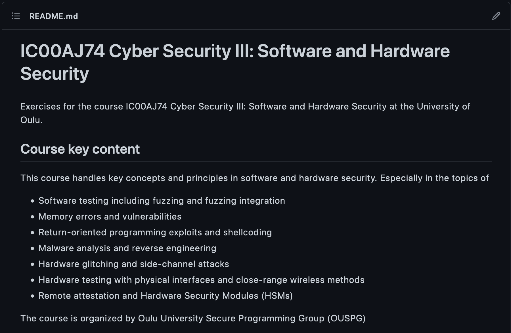

# Answer template, week 7

Add your work to this template and make every task from the instruction repository to get full points (and even more from the bonus tasks). 

If screenshots are required, remember to reference them here.
Markdown allows rendering them directly as part of the document.

If your code is required, you can add it to this document by using `code blocks`. 
You can create your `src` folder for all code, in case there is plenty of it. 
In general, you have the freedom to express your work as you like.

**Remember to mention/reference all your attachments in this main document!**

**Also, remember to mention if you collaborate with someone!**

You should remove all of the examples and instructions from this document.

The template is identical for every week.

---

## Task 1

### Task 1.1

***Lorem Ipsum*** is simply dummy text of the printing and typesetting industry. Lorem Ipsum has been the industry's standard dummy text ever since the 1500s, when an unknown printer took a galley of type and scrambled it to make a type specimen book. It has survived not only five centuries, but also the leap into electronic typesetting, remaining essentially unchanged. It was popularised in the 1960s with the release of Letraset sheets containing Lorem Ipsum passages, and more recently with desktop publishing software like Aldus PageMaker including versions of Lorem Ipsum.

### Task 1.x

An example code block for Python highlighting:

```python
# In Python syntax
print("Hello, World!")
```

Example command in console format:
```console
$ for j in {1..9};do echo "Hello $j";done
```

## Task 2

### Task 2.1

Example image from the other directory. You can create own for this directory for the images if they are needed.



### Task 2.x

## Task x
